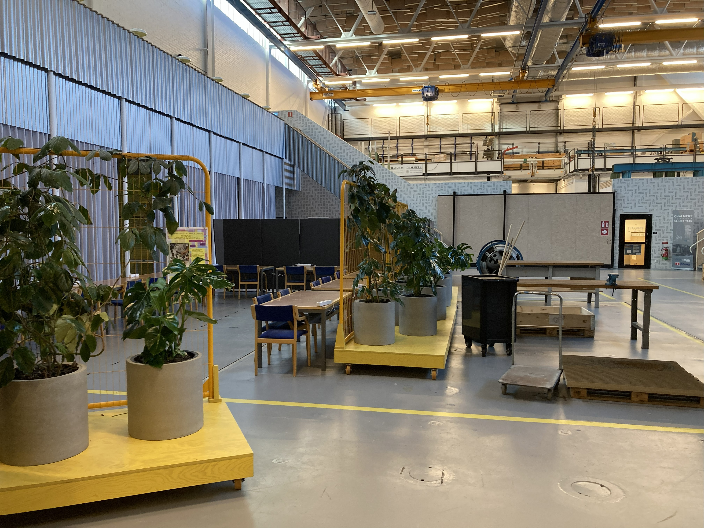

<!-- _color: black -->

# Cool title with a Background

The code above the title is a local directive:

https://marpit.marp.app/directives?id=local-directives-1

---

# What is TRA 385?

This is a list:

- item 1
- item 2
- item 3

---

# This is a table 

| Activities  |  |  | | |
|:---|---|---|---|---|
| **Lectures** | Introduction to Art and Technology | Introduction to AI and ML | Creativity, Group work, and Tools for Innovation |
| **Tutorials** | Creative Coding with Sound (PureData) | Multimedia Design with TouchDesigner | Deep Learning for Multimedia | Interactive ML with Physical Computing |
| **Project** |Project Proposal| Design Iterations | Final Prototype | Reflections |

---

# Image on the left

---

# AND Image on the right

---

# Local videos are possible 

<video controls src="pb-ars.mp4" width="800"></video>

---

# Online videos as well 

<iframe width="560" height="315" src="https://www.youtube.com/embed/nx2Nj3I7NyU?si=5D-PemuLUUt3qepd&amp;controls=0" title="YouTube video player" frameborder="0" allow="accelerometer; autoplay; clipboard-write; encrypted-media; gyroscope; picture-in-picture; web-share" referrerpolicy="strict-origin-when-cross-origin" allowfullscreen></iframe>

This should work only when the presentation is hosted online. Youtube does not allow local hosts apparently.

---

# Fancy image options

` ` command works for creating empty spaces [2].

 

<small>[1] this is a smaller text. Great for citations. 

[2] https://marpit.marp.app/image-syntax
</small>

---

# Inline HTML commands works 

 Text can be changed for example 

---

---
# ToDos

- Check Katex integration

